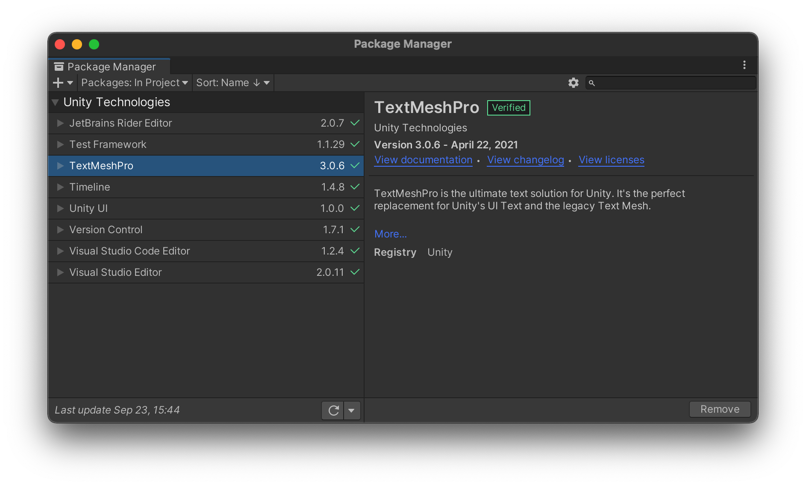
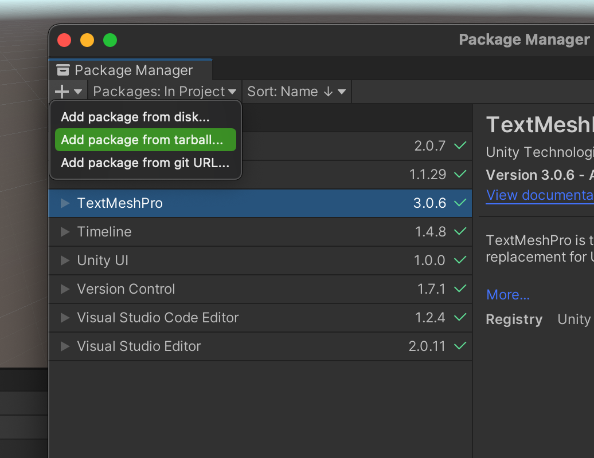
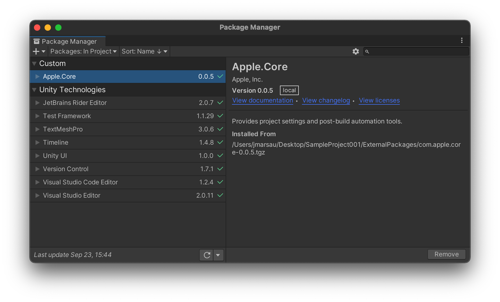

| [Home](../README.md) | [Feedback](Feedback.md) | [Quick Start Guide](Quickstart.md) | [Build Script](BuildScript.md) |
| :---: | :---: | :---: | :---: |


# Apple Unity Plug-In Quick Start Guide
If you're new to working with Unity plug-ins, this guide should get you up and running in no time. Here's what this guide covers:
* [1. Download](#1-Download) &mdash; Where to find the plug-ins
* [2. Build](#2-Build) &mdash; Compiling the native libraries
* [3. Install](#3-Install) &mdash; Adding the plug-ins to your project

## 1. Download
The first step is to download or clone the [Apple-Unity Plug-ins repository](https://github.com/apple/unityplugins), which contains all of the Apple Unity Plug-ins. Note that you can mix and match which plug-ins you use in your project in any combination with one exception: the Apple.Core plug-in must be installed for any of the other plug-ins to function properly.

| Plug-In | Readme |
|:--------|:------|
| Apple.Core | [Apple.Core Documentation](../plug-ins/Apple.Core/Apple.Core_Unity/Assets/Apple.Core/Documentation~/Apple.Core.md) |
| Apple.Accessibility | [Apple.Accessibility Documentation](../plug-ins/Apple.Accessibility/Apple.Accessibility_Unity/Assets/Apple.Accessibility/Documentation~/Apple.Accessibility.md) |
| Apple.CoreHaptics | [Apple.CoreHaptics Documentation](../plug-ins/Apple.CoreHaptics/Apple.CoreHaptics_Unity/Assets/Apple.CoreHaptics/Documentation~/Apple.CoreHaptics.md) |
| Apple.GameController | [Apple.GameController Documentation](../plug-ins/Apple.GameController/Apple.GameController_Unity/Assets/Apple.GameController/Documentation~/Apple.GameController.md) | 
| Apple.GameKit | [Apple.GameKit Documentation](../plug-ins/Apple.GameKit/Apple.GameKit_Unity/Assets/Apple.GameKit/Documentation~/Apple.GameKit.md) | 
| Apple.PHASE | [Apple.PHASE Documentation](../plug-ins/Apple.PHASE/Apple.PHASE_Unity/Assets/Documentation~/Apple.PHASE.md) | 

## 2. Build
After downloading the plug-in(s), you will need to build the native libraries. If you are familiar with Unity plug-ins, these are compiled assets found in a Unity project's `Assets/.../Plugins/{iOS, macOS, tvOS}/` directories. Along with some C# bridging scripts, they enable communication with Apple devices' native technologies.

For your convenience, there is a Python3 script included in this repo. It requires that you have Xcode, python3, npm, and Unity installed and makes building and managing the native libraries simple. If you don't already have Xcode installed, you can find it [here](https://developer.apple.com/xcode/). This script, `build.py`, is located at the root directory of the repo. The easiest way to build the plug-ins is by running:

```bash
python3 build.py
```

This will build all of the native libraries using `xcodebuild` and then package the Unity plug-ins each into compressed tarball (`.tgz`) files. These `.tgz` packages will be placed in a `Build` directory, located in the repo's base directory.

The build script includes a number of options for customizing the build process. To see a summary of these options, run:

```bash
python3 build.py --help
``` 

For more details and usage examples, please see [Advanced Build Script Usage](BuildScript.md).


## 3. Install

### Unity Package Manager
Installation of each plug-in is managed via the Unity Package Manager (UPM). This is Unity's integrated package management system and is the preferred means of managing plug-in installation and update. To open the UPM, select **Window > Package Manager** from the Unity Editor menu.

You should now see the UPM window:



To illustrate the steps for installing the packages downloaded from the links above, we'll walk through the steps to install Apple.Core into a Unity project. These steps will be the same for installation of each Apple Unity plug-in.

### Installing Compressed Tarball Packages
The fastest way to get going with the plug-ins is to directly reference the tarball packages built in step 2 above. However, please note that directly referencing a plug-in from `.tgz` will load it as read-only into your project. If you plan on contributing to the plug-ins, please see this page (link coming soon) to link the plug-ins and enable local development. For more information on working with each plug-in, be sure to read the corresponding documentation (linked above) to understand their features and suggested usage.

From the UPM window, open the **+** dropdown menu in the upper left corner and choose the option **Add package from tarball...**



This will open a pop-up window allowing you to browse to the location of the downloaded tarball.


Lastly, select **Open** and the package will be loaded into your project and Unity will compile any plug-in scripts. After compilation finishes, the UPM window should now show the plug-in loaded under the "Custom" heading with a green check mark:



Your project can now take advantage of the features associated with the plug-in(s).
